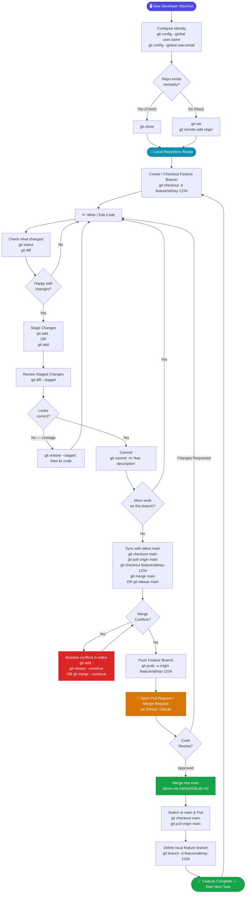
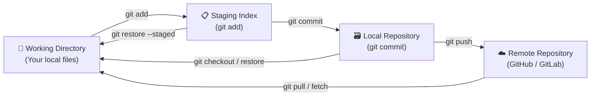
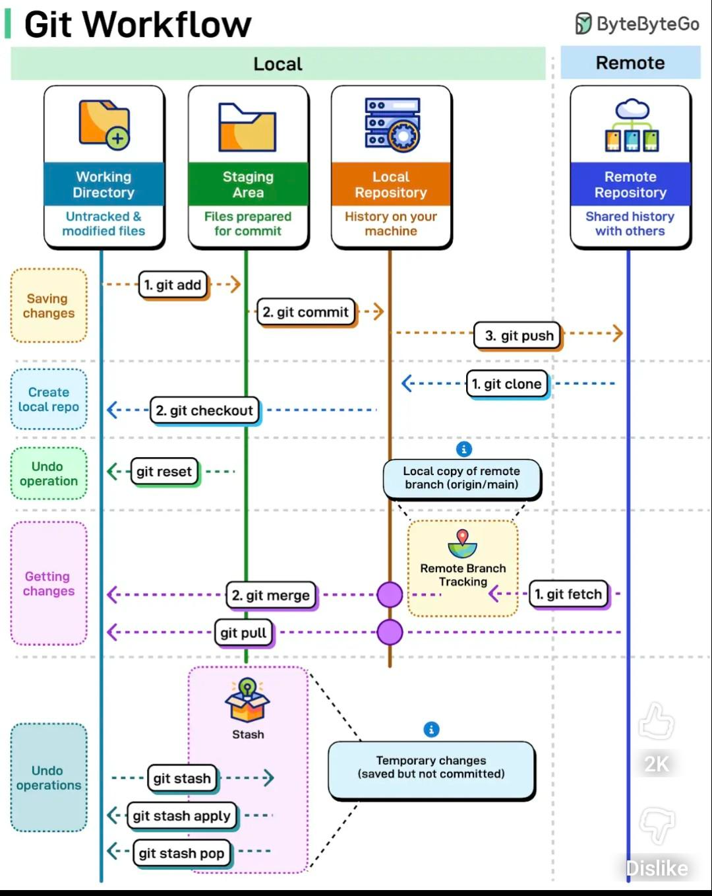

# Git Developer Reference Guide

A practical Git reference for day-to-day development on this project.

---

## 1. Initial Project Setup (First Time Only)

```bash
git init                                          # Initialize a new Git repo
git add .                                         # Stage all files
git commit -m "Initial commit"                    # Make the first commit
git switch -c main                                # Create and switch to 'main' branch
git remote add origin <REPO_URL>                  # Link to remote repository
git branch -M main                                # Rename current branch to 'main'
git pull origin main --rebase                     # Pull remote changes (rebase style)
git push -u origin main                           # Push and set upstream tracking
```

> **Example remote URL:** `https://github.com/abhay-kumar-a/frontend.git`

---

## 2. Configure Git Identity (Do This Once Per Machine)

Before making any commits, tell Git who you are. This info appears in every commit.

```bash
# Set your name and email globally (applies to all repos on this machine)
git config --global user.name "Abhay Kumar"
git config --global user.email "abhay@example.com"

# Verify your configuration
git config --list

# Set identity for only the current repo (overrides global)
git config user.name "Abhay Kumar"
git config user.email "abhay@example.com"
```

---

## 3. Git Credentials — Saving Your Password/Token

Every time you push/pull, Git may ask for your username and password. Avoid that by storing credentials.

### Option A: Credential Store (HTTPS — saves to disk)
```bash
# Save credentials permanently on disk (simple, less secure)
git config --global credential.helper store

# Next time you push, Git will ask once and remember forever
git push origin main
# → Enter username + token once → stored in ~/.git-credentials
```

### Option B: Credential Cache (HTTPS — saves temporarily in memory)
```bash
# Cache credentials for 1 hour (3600 seconds)
git config --global credential.helper 'cache --timeout=3600'
```

### Option C: Personal Access Token (GitHub / GitLab)

Modern Git servers **no longer accept plain passwords**. Use a token instead.

1. Go to GitHub → **Settings → Developer Settings → Personal Access Tokens → Generate new token**
2. Copy the token (you won't see it again)
3. Use it as your **password** when Git prompts you:

```
Username: abhay-kumar-a
Password: ghp_YourTokenHere123456   ← paste token here, NOT your real password
```

### Option D: SSH Key (Most Secure — No Password Prompts)
```bash
# Step 1: Generate SSH key pair
ssh-keygen -t ed25519 -C "abhay@example.com"
# → Press Enter to accept defaults, optionally set a passphrase

# Step 2: View your public key
cat ~/.ssh/id_ed25519.pub
# → Copy the output

# Step 3: Add public key to GitHub
# GitHub → Settings → SSH and GPG keys → New SSH key → Paste

# Step 4: Test the connection
ssh -T git@github.com
# → Hi abhay-kumar-a! You've successfully authenticated.

# Step 5: Use SSH remote URL instead of HTTPS
git remote set-url origin git@github.com:abhay-kumar-a/frontend.git
```

> **Tip:** Use `git remote -v` to check whether your repo uses HTTPS or SSH.

---

## 4. .gitignore — What to Exclude from Git

A `.gitignore` file tells Git which files and folders to **never track**.
These are typically build artifacts, secrets, IDE files, and OS files.

### How to Create
```bash
# Create in the root of your project
touch .gitignore        # Linux/Mac/Git Bash
echo. > .gitignore      # Windows Command Prompt

# Then open it and add patterns (see examples below)
```

### .gitignore for a Java / Maven / Spring Boot Project
```gitignore
# ─── Compiled Output ───────────────────────────────────────────
target/                    # Maven build output
*.class                    # Compiled Java classes
*.jar                      # JAR files (unless you intentionally commit them)
*.war
*.ear

# ─── IDE Files ─────────────────────────────────────────────────
.idea/                     # IntelliJ IDEA project files
*.iml                      # IntelliJ module files
.eclipse/
.classpath
.project
.settings/

# ─── Environment & Secrets ─────────────────────────────────────
.env                       # Environment variables (NEVER commit this)
.env.local
application-local.properties   # Local Spring Boot config overrides
secrets.yml

# ─── Logs ──────────────────────────────────────────────────────
*.log
logs/

# ─── OS Files ──────────────────────────────────────────────────
.DS_Store                  # Mac metadata
Thumbs.db                  # Windows thumbnail cache
```

### .gitignore for a Node.js / Frontend Project
```gitignore
# ─── Dependencies ──────────────────────────────────────────────
node_modules/              # Never commit — use npm install to restore

# ─── Build Output ──────────────────────────────────────────────
dist/
build/
.next/

# ─── Environment & Secrets ─────────────────────────────────────
.env
.env.local
.env.production

# ─── Logs ──────────────────────────────────────────────────────
*.log
npm-debug.log*

# ─── IDE & OS ──────────────────────────────────────────────────
.vscode/
.DS_Store
Thumbs.db
```

### Useful .gitignore Patterns Explained

| Pattern | Meaning |
|---|---|
| `target/` | Ignore the folder named `target` |
| `*.log` | Ignore all files ending with `.log` |
| `!important.log` | Exception: **do** track this specific `.log` file |
| `.env` | Ignore the `.env` file |
| `**/temp` | Ignore any folder named `temp` anywhere in the project |
| `doc/*.txt` | Ignore `.txt` files directly inside `doc/` only |

### After Adding .gitignore — Remove Already-Tracked Files

If you accidentally committed a file **before** adding it to `.gitignore`:

```bash
# Stop tracking a file (removes from Git, keeps on disk)
git rm --cached .env
git rm --cached -r node_modules/    # Recursively for folders

# Commit the removal
git commit -m "chore: stop tracking .env and node_modules"
git push
```

> ⚠️ **Important:** If `.env` or secrets were committed, consider them **compromised**.
> Rotate/revoke the exposed credentials immediately, even after removing from Git.

---

## 5. Everyday Workflow

### Check Current Status
```bash
git status                  # Show staged, unstaged, and untracked files
git log                     # View commit history (full)
git branch                  # List all local branches
```

### Viewing Differences
```bash
git diff                    # Show unstaged changes (working dir vs index)
git diff --staged           # Show staged changes (index vs last commit)
git diff HEAD               # Show all changes since last commit
git diff -w                 # Show changes, ignoring whitespace
git diff --summary          # Show a summary of what changed
```

### Stage & Commit
```bash
git add .                   # Stage all changes
git restore --staged .      # Unstage all staged changes (undo git add)
git commit -m "your message here"
```

---

## 6. Working with Branches

### Create & Switch Branches
```bash
git branch <branch-name>          # Create a new branch
git checkout <branch-name>        # Switch to a branch
git checkout -b <branch-name>     # Create and switch in one step
```

### Merge & Rebase
```bash
git checkout main
git pull origin main              # Always pull latest main first

git checkout feature/your-branch
git merge main                    # Merge main into your feature branch
# OR
git rebase main                   # Rebase your branch on top of main
```

### Delete a Branch
```bash
# First switch away from the branch you want to delete
git checkout main

git branch -d <branch-name>       # Safe delete (only if merged)
git branch -D <branch-name>       # Force delete
```

> **Tip:** Avoid typos in branch names.  
> Example fix: delete `frature/abhay`, keep `feature/abhay`

---

## 7. Inspecting Branches & Files

```bash
# View commit history of a specific branch
git log frature/abhay --oneline

# List all files tracked in a specific branch
git ls-tree -r frature/abhay --name-only

# View a specific file from another branch
git show main:src/main/java/com/example/MyFile.java

# Diff a specific staged file
git diff --staged src/path/to/YourFile.java
```

---

## 8. Fixing Mistakes

### Remove an Unwanted / Corrupt File
```bash
# Delete a file with special characters in its name
git rm "filename-with-special-chars"

git commit -m "deleted: removed unwanted file"
```

### Force Push (use carefully!)
```bash
git push --force origin <your-branch>
```

> ⚠️ **Warning:** Force push rewrites remote history. Never use on `main` or shared branches.

---

## 9. Updating All Modules at Once (Bash Scripts)

### Pull Latest `main` for All Modules
```bash
for dir in "/d/var/new frontend_worspace/"/*/; do
  if [ -d "$dir/.git" ]; then
    cd "$dir" && git pull origin main
    cd "/d/var/new agrinet_worspace"
  fi
done
```

### Check Status of All Modules
```bash
for dir in "/d/var/new frontend_worspace/"/*/; do
  if [ -d "$dir/.git" ]; then
    echo "==============================="
    echo "Module: $dir"
    echo "==============================="
    git -C "$dir" status --short
  fi
done
```

---

## 10. Quick Reference Table

| Command | What It Does |
|---|---|
| `git status` | Show current state of working directory |
| `git add .` | Stage all changes |
| `git restore --staged .` | Unstage everything |
| `git commit -m "msg"` | Commit staged changes |
| `git pull origin main` | Fetch & merge latest main |
| `git push -u origin <branch>` | Push branch and set upstream |
| `git branch` | List local branches |
| `git checkout <branch>` | Switch branches |
| `git merge main` | Merge main into current branch |
| `git rebase main` | Rebase current branch onto main |
| `git log --oneline` | Compact commit history |
| `git diff --staged` | Review what you're about to commit |
| `git config --global user.name` | Set your Git username |
| `git config --list` | View all Git config values |
| `git rm --cached <file>` | Stop tracking a file (keep on disk) |
| `git remote -v` | Show remote URL (HTTPS or SSH) |
| `ssh -T git@github.com` | Test SSH connection to GitHub |

---

## 11. Recommended Branch Naming Convention

```
feature/abhay-<ticket-number>     # New features
fix/abhay-<ticket-number>         # Bug fixes
Abhay/abhay-<description>         # Personal developer branches
```

---

## 12. Git Workflow — Full Flow Diagram

> This diagram shows the complete lifecycle from first-time setup to pushing code and syncing updates.



### What Each Zone Means

| Zone | Color | Purpose |
|---|---|---|
| **Setup** | Indigo | One-time machine config |
| **Branch & Code** | Blue | Daily development loop |
| **Stage & Commit** | Default | Saving changes locally |
| **Push & Review** | Amber | Sharing with the team |
| **Merge & Sync** | Green | Integrating back to main |
| **Conflict** | Red | Needs manual resolution |

---

## 13. Git Areas — Where Your Code Lives



> **Key Insight:**  
> - `git add` moves changes from **Working Directory → Staging**  
> - `git commit` moves changes from **Staging → Local Repo**  
> - `git push` syncs **Local Repo → Remote**  
> - `git pull` brings **Remote → Local** (fetch + merge in one step)

---

*Keep this file updated as your team's Git workflow evolves.*


